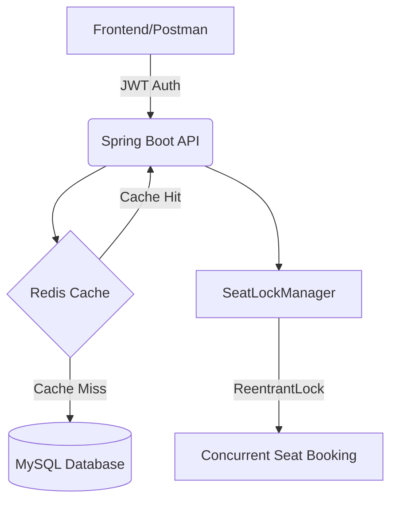

# 🎬 Movie Reservation System API

[](https://www.oracle.com/java/)
[](https://spring.io/projects/spring-boot)
[](https://redis.io/)
[](https://www.docker.com/)

A high-performance, concurrent-safe backend system for booking movie tickets. This project mimics real-world platforms like **BookMyShow**, featuring role-based security, dynamic seat management, and a robust locking mechanism to prevent double-booking.

---

## 📋 Table of Contents
- [Overview](#-overview)
- [Architecture](#%EF%B8%8F-architecture)
- [Features](#-features)
- [Tech Stack](#%EF%B8%8F-tech-stack)
- [Project Structure](#-project-structure)
- [How It Works](#-how-it-works)
- [API Endpoints](#-api-endpoints)
- [Installation](#-installation)
- [Future Enhancements](#-future-enhancements)

---

## 🌟 Overview
This platform provides a complete solution for movie theater management and ticket booking:
* **Authentication:** Secure user registration and login using JWT.
* **Management:** Admin tools to schedule movies, create theaters, and manage seat pricing.
* **Concurrency:** Industry-standard locking to ensure two users cannot book the same seat simultaneously.
* **Performance:** Redis-based caching to reduce database load for frequent lookups.

---

## 🏗️ Architecture



---

## ✨ Features

- 🔐 **Stateless Authentication**  
  Custom JWT filter for secure, token-based sessions.

- 👮 **Role-Based Access Control (RBAC)**  
  Distinct permissions for:
  - USER
  - ADMIN
  - SUPER_ADMIN

- ⚡ **Concurrency Handling**  
  Uses `ConcurrentHashMap` and `ReentrantLock` to prevent race conditions during booking.

- 🚀 **Performance Optimization**  
  Spring Data Redis integration for high-speed data retrieval.

- 🧪 **Automated Testing**  
  Comprehensive unit testing with:
  - JUnit 5
  - Mockito

- 🐳 **Containerized**  
  Fully Dockerized for seamless deployment.

---

## 🛠️ Tech Stack

| Category   | Technology |
|------------|------------|
| Framework  | Spring Boot 3.3.5 |
| Language   | Java 17 |
| Security   | Spring Security & JJWT |
| Database   | MySQL 8.0 (Persistence) |
| Caching    | Redis |
| ORM        | Spring Data JPA (Hibernate) |
| Testing    | JUnit 5, Mockito |
| DevOps     | Docker |

---

## 📁 Project Structure

```
movie-reservation-system/
├── src/main/java/com/project/movie_reservation_system/
│   ├── config/             # Security & JWT configurations
│   ├── controller/         # REST API Controllers
│   ├── dto/                # Data Transfer Objects
│   ├── entity/             # JPA Domain Entities
│   ├── enums/              # Enumerated types (Roles, Status)
│   ├── exception/          # Custom Exceptions & Global Handler
│   ├── repository/         # Data Access Layer
│   ├── seeder/             # Initial database population (Super Admin)
│   └── service/            # Business Logic Layer
├── src/test/java/          # Unit & Integration Tests
├── Dockerfile              # Containerization instructions
└── pom.xml                 # Maven dependencies & build config
```

---

## 🔄 How It Works

### 🎟️ The "Double Booking" Problem

**1️⃣ Request Arrival**  
`ReservationService` attempts to book seats.

**2️⃣ Lock Acquisition**  
The system requests a `ReentrantLock` for the specific `seatId` from `SeatLockManager`.

**3️⃣ Validation**  
If the lock is acquired:
- It verifies the seat is still `UNBOOKED` in the database.

**4️⃣ Completion**
- The seat status is updated to `BOOKED`
- The reservation is saved
- The lock is released

This guarantees that two users cannot book the same seat simultaneously.

---

## 🌐 API Endpoints

### 🔐 Authentication

| Method | Endpoint | Description |
|--------|----------|-------------|
| POST   | `/auth/signup` | Register a new user |
| POST   | `/auth/authenticate` | Login and receive JWT |

---

### 👮 Management (Admin)

| Method | Endpoint | Description |
|--------|----------|-------------|
| POST   | `/api/v1/movies/create` | Add a new movie |
| POST   | `/api/v1/theaters/theater/create` | Add a new theater |
| POST   | `/api/v1/shows/show/create` | Schedule a movie show |

---

### 🎟️ Reservations (User)

| Method | Endpoint | Description |
|--------|----------|-------------|
| GET    | `/api/v1/shows/all` | Browse all available shows |
| POST   | `/api/v1/reservations/reserve` | Book tickets for a show |
| POST   | `/api/v1/reservations/cancel/{id}` | Cancel a booking |

---

## 🚀 Installation

### 1️⃣ Clone the Repository

```bash
git clone https://github.com/Akshul1/movie-reservation-system
cd movie-reservation-system
```

---

### 2️⃣ Start Redis (Docker)

```bash
docker run -d --name redis-server -p 6379:6379 redis
```

---

### 3️⃣ Configure Database

Update:

```
src/main/resources/application.properties
```

Add your MySQL credentials:

```properties
spring.datasource.url=jdbc:mysql://localhost:3306/moviedb
spring.datasource.username=root
spring.datasource.password=yourpassword
```

---

### 4️⃣ Run Application

```bash
./mvnw spring-boot:run
```

---

## 🔮 Future Enhancements

- 💳 **Payment Gateway Integration**  
  Integrate Stripe or PayPal to handle actual financial transactions.

- 🚀 **Advanced Redis Caching**  
  Implement caching for high-traffic endpoints like "Get All Movies".

- 📧 **Email Notifications**  
  Automate booking confirmations and cancellation alerts via SMTP.

- ☁️ **AWS Migration**  
  - RDS for MySQL  
  - ElastiCache for Redis  
  - ECS/Fargate for API deployment
